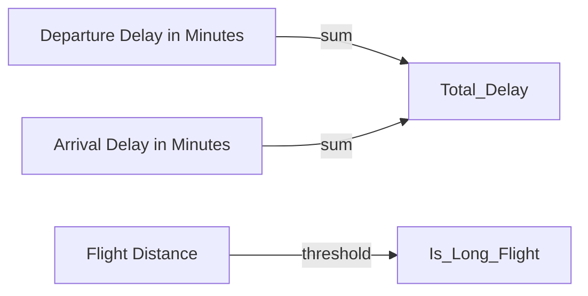

# UML Class Diagram — Airline Customer Satisfaction Dataset

## Mermaid Diagram

```mermaid
classDiagram
    class AirlineSurveyRecord {
        <<Entity>>
        +satisfaction : String &#123;satisfied, dissatisfied&#125;
    }

    class PassengerDemographics {
        <<Feature Group>>
        +Age : int [7 - 85]
        +Customer Type : String &#123;Loyal, disloyal&#125;
        +Type of Travel : String &#123;Business, Personal&#125;
        +Class : String &#123;Business, Eco Plus, Eco&#125;
    }

    class FlightDetails {
        <<Feature Group>>
        +Flight Distance : int [50 - 6951] km
        +Departure Delay in Minutes : int [0 - 1592]
        +Arrival Delay in Minutes : float [0 - 1584] *393 nulls
    }

    class ServiceRatings {
        <<Feature Group>>
        +Seat comfort : int [0-5]
        +Departure/Arrival time convenient : int [0-5]
        +Food and drink : int [0-5]
        +Gate location : int [0-5]
        +Inflight wifi service : int [0-5]
        +Inflight entertainment : int [0-5]
        +Online support : int [0-5]
        +Ease of Online booking : int [0-5]
        +On-board service : int [0-5]
        +Leg room service : int [0-5]
        +Baggage handling : int [0-5]
        +Checkin service : int [0-5]
        +Cleanliness : int [0-5]
        +Online boarding : int [0-5]
    }

    class EngineeredFeatures {
        <<Derived>>
        +Total_Service_Score : float
        +online_experience_score : float
        +inflight_experience_score : float
        +ground_experience_score : float
        +Total_Delay : float
        +Is_Long_Flight : int &#123;0, 1&#125;
    }

    class Target {
        <<Label>>
        +satisfaction : int &#123;0 = dissatisfied, 1 = satisfied&#125;
        --
        satisfied: 71,087 (54.7%)
        dissatisfied: 58,793 (45.3%)
    }

    AirlineSurveyRecord "1" *-- "1" PassengerDemographics : has
    AirlineSurveyRecord "1" *-- "1" FlightDetails : has
    AirlineSurveyRecord "1" *-- "1" ServiceRatings : rates
    AirlineSurveyRecord "1" *-- "1" Target : labeled as

    ServiceRatings ..> EngineeredFeatures : aggregated into
    FlightDetails ..> EngineeredFeatures : derived from
```



## Dataset Summary

| Property | Value |
|----------|-------|
| **Total Records** | 129,880 |
| **Total Features** | 22 (raw) → 29 (after engineering) |
| **Categorical Features** | 3 (Customer Type, Type of Travel, Class) |
| **Continuous Features** | 4 (Age, Flight Distance, Departure Delay, Arrival Delay) |
| **Service Rating Features** | 14 (ordinal 0-5 scale) |
| **Target Variable** | satisfaction (binary) |
| **Missing Values** | 393 in Arrival Delay (0.3%) |
| **Duplicates** | 0 |

## Feature Group Details

### Service Ratings → Engineered Composites

```mermaid
flowchart LR
    subgraph Online Experience
        OB[Online boarding]
        IW[Inflight wifi service]
        OS[Online support]
        EO[Ease of Online booking]
    end

    subgraph Inflight Experience
        SC[Seat comfort]
        FD[Food and drink]
        IE[Inflight entertainment]
        LR[Leg room service]
        OBS[On-board service]
        CL[Cleanliness]
    end

    subgraph Ground Experience
        GL[Gate location]
        DA[Dep/Arr time convenient]
        CS[Checkin service]
        BH[Baggage handling]
    end

    Online Experience -->|mean| OES[online_experience_score]
    Inflight Experience -->|mean| IES[inflight_experience_score]
    Ground Experience -->|mean| GES[ground_experience_score]
    Online Experience -->|mean of all 14| TSS[Total_Service_Score]
    Inflight Experience -->|mean of all 14| TSS
    Ground Experience -->|mean of all 14| TSS
```

### Delay Features → Engineered


